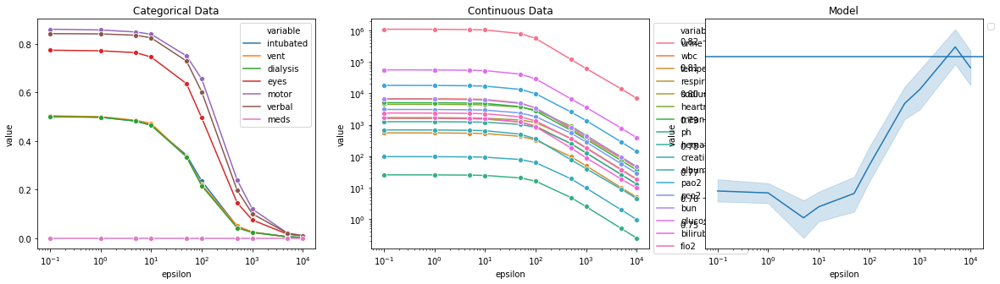

<!-- PROJECT LOGO -->
<br />
<p align="center">
  <h1 align="center">Multivariable Diffrential Privacy</h1>

<!-- TABLE OF CONTENTS -->
## Table of Contents
* [About the Project](#about-the-project)
  * [Built With](#built-with)
* [Getting Started](#getting-started)
  * [Prerequisites](#prerequisites)
  * [Installation](#installation)
* [Usage](#usage)
* [Contact](#contact)


<!-- ABOUT THE PROJECT -->
## About The Project
This code generate the data which was applied Local Diffential Privacy(LDP).  
We use bounded laplacian method, and discretize in the categorical values.   
Used data was the subset of eICU APACHE score data.  
After applying the LDP, we validate data in three steps: categorical values, continuous values, and model validation.  
The model was predict the motality in ICU by APACHE score variables.   



### Built With
* [Python](https://www.python.org)

<!-- GETTING STARTED -->
## Getting Started

This is an example of how you may give instructions on setting up your project locally.
To get a local copy up and running follow these simple example steps.

### Prerequisites
This is an example of how to list things you need to use the software and how to install them.
* pip
```sh
pip install -r requirments.txt
```

### Set the configurations
`config.py` has configurations of the program.

### RUN
1. `python main.py`


<!-- CONTACT -->
## Contact

Your Name - sungmindong [at] gmail.com
Project Link: [https://github.com/mdsung/multiple_variable_differential_privacy.git](https://github.com/mdsung/multiple_variable_differential_privacy.git)

